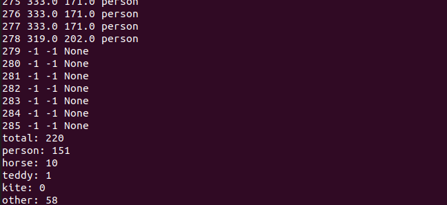
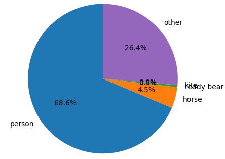

# Urarachallenge + YOLOv5

## Requirements

- ROS2
- [YOLOv5-ROS](https://github.com/Ar-Ray-code/YOLOv5-ROS)
- [bbox_ex_msgs](https://github.com/Ar-Ray-code/bbox_ex_msgs) (ROS2 Message created by Ar-Ray)

## Installation

### ROS2

It is omitted here.

### YOLOv5-ROS

```bash
mkdir -p ~/ros2_ws/src
git clone --recursive https://github.com/Ar-Ray-code/YOLOv5-ROS.git
cd ~/ros2_ws
source /opt/ros/foxy/setup.bash
colcon build --symlink-install
```

## Run

### 1. YOLOv5-ROS

```bash
git clone https://github.com/Ar-Ray-code/urarachallenge_analyzer.git
cd urarachallenge_analyzer/YOLOv5
ros2 launch ./yolov5s.launch.py
```

### 2. urarachallenge.py

```bash
cd urarachallenge_analyzer/YOLOv5
python3 urarachallenge.py
```

2.1 : select csv file (The coordinates of the target umamusume will be recorded.)

2.2 : select video file

## Output

1 : terminal output



2 : csv file  `report.csv`

3 : pi chart  `report.png`


 